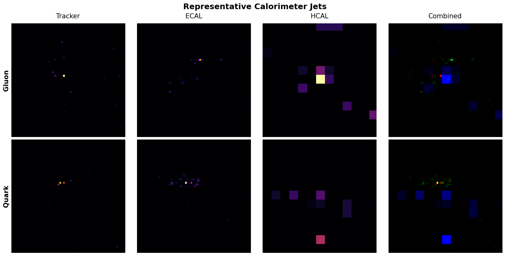
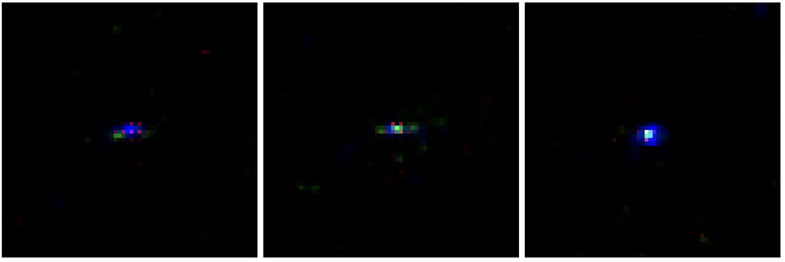
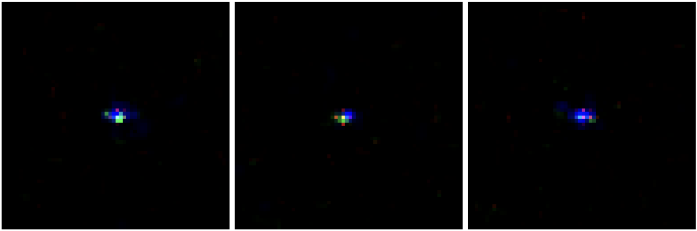
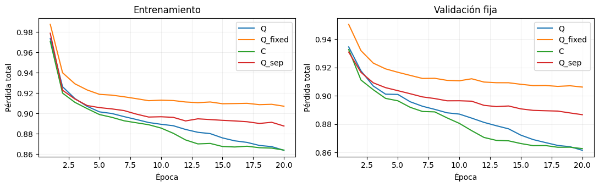
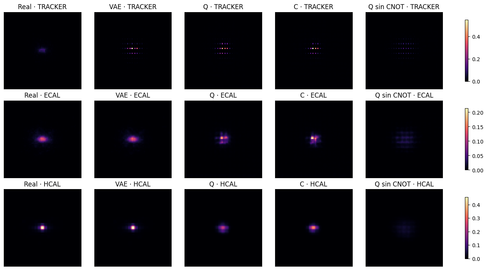

Google Summer of Code 2026 · ML4SCI · QMLHEP

## Project Overview {.unnumbered}

This Google Summer of Code project investigated classical and hybrid quantum–classical generative models for sparse quark and gluon jet images. I developed image-space diffusion baselines, a conditional latent diffusion pipeline, and several ways to incorporate parametrized quantum circuits into denoising. The final experiments replaced the latent U-Net with compact denoisers built around quantum circuits and evaluated them against classical and circuit-based controls.

The trained circuits contributed to denoising, but the completed comparisons did not establish an overall advantage over a compact classical alternative. The classical latent U-Net remained the strongest quality reference. The work provides implementations, diagnostics, and controlled comparisons for assessing quantum participation in this setting.

**Project code:** [GitHub repository][project-code]. Links to the available implementations accompany the experimental sections.

# Introduction

High-energy physics experiments require large samples of simulated particle interactions and detector responses. Generative models offer a way to investigate faster simulation approaches, but sparse detector images require more than visual agreement: generated samples must also reproduce occupancy, integrated signal, and spatial distributions.

Diffusion models learn to reverse a noise process [@ho2020ddpm]. Latent diffusion performs this process in a compressed representation obtained from an autoencoder [@rombach2022ldm], which also provides smaller inputs for quantum processing. The project therefore progressed from classical image-space models to conditional latent diffusion and then to hybrid quantum–classical denoisers.

The quantum investigation asked two questions: can trainable circuits contribute meaningfully to denoising, and does that contribution improve performance over suitable classical alternatives? Denoising loss, generated-sample observables, and computational cost were evaluated separately to answer these questions.

# Dataset and Preprocessing

The experiments used preprocessed ($64\times64\times3$) jet images from a dataset of approximately 139,000 events, with quark/gluon labels and Tracker, ECAL, and HCAL channels. The data are highly sparse: approximately 95% of pixels are inactive. This makes background suppression and the preservation of localized signals central to the evaluation.

{fig-align="center" width="100%"}

Earlier image-space experiments used logarithmically transformed, normalized inputs. The final quantum-core comparison used a reproducible 80/10/10 train/validation/test partition with seed 42, selecting 10,000 training and 2,500 validation events. Its notebook also defined a separate 2,500-event test subset; the results reported here use validation data rather than that test subset.

For this final comparison, each image channel was scaled using the 99.5th percentile of active training pixels, clipped to ($[0,1]$), and mapped to ($[-1,1]$). The same fitted scales were applied to validation data. Latents were subsequently standardized using training statistics. These preprocessing steps were shared by the models within that comparison; numerical results from different experimental stages should be interpreted within their stated evaluation protocols.

Throughout the result tables, **integrated intensity** denotes the sum of normalized pixel values after mapping images to ($[0,1]$). It is a diagnostic in preprocessed units, not calibrated energy in GeV. Lower Wasserstein-1 (W1) distances indicate closer agreement with the real-data distributions.

# Classical Diffusion and Physics-Aware Improvements

## Models and Training Objective

I first implemented a U-Net-based DDPM and explored DDIM sampling [@song2021ddim] and Flow Matching [@lipman2023flow]. These experiments established classical baselines and identified the main failure modes of generation in sparse image space.

Early models reduced their training loss while generating excessive activity and integrated intensity. Using DDPM as a testbed, I introduced ($v$)-prediction [@salimans2022progressive] and penalties for active cells, unwanted background, and integrated signal. The resulting DDPM objective had the form

$$
\mathcal{L}
=\mathcal{L}_{v}
+\lambda_{\mathrm{active}}\mathcal{L}_{\mathrm{active}}
+\lambda_{\mathrm{bg}}\mathcal{L}_{\mathrm{bg}}
+\lambda_E\mathcal{L}_E.
$$

The active-cell term emphasized sparse signals, the background term penalized spurious activity, and the integrated-intensity term constrained the overall signal level. The method-specific targets and implementations are documented in the linked notebooks. The comparisons below use common observable definitions rather than assuming that identical notation implies identical prediction targets across methods.

**Source code:** [DDPM][ddpm-code] · [DDIM][ddim-code] · [Flow Matching][flow-code].

## Image-Space Results

The recorded image-space comparison assessed integrated intensity, active-pixel fraction, and participation ratio (PR), which describes how broadly the signal is distributed over pixels.

| Model | Mean integrated intensity | Intensity W1 ↓ | Active fraction | Active W1 ↓ | PR | PR W1 ↓ |
|---|---:|---:|---:|---:|---:|---:|
| Real data | 25.536 | — | 0.047 | — | 93.162 | — |
| DDPM | 65.507 | 39.972 | 0.448 | 0.401 | 456.387 | 363.445 |
| DDIM | 42.224 | 16.688 | 0.295 | 0.247 | 169.004 | 77.283 |
| Flow Matching | 34.928 | 9.391 | 0.0282 | 0.019 | 109.196 | 20.263 |

Flow Matching achieved the closest agreement among these image-space models on the reported W1 metrics. However, remaining discrepancies motivated the transition to latent diffusion. This stage established that evaluation needed to track sparse structure and signal distributions alongside the training loss.

# Latent Diffusion

## VAE and Conditional Denoising

I developed a convolutional variational autoencoder (VAE) [@kingma2014vae] to map detector images into a spatial latent representation. Training combined reconstruction and Kullback–Leibler regularization, with additional attention to sparse reconstruction. The final quantum-comparison pipeline used ($4\times16\times16$) latents and occupancy-aware decoding to suppress unwanted background.

A class-conditional U-Net learned denoising in this latent space. The VAE was frozen during denoiser training, and generated latents were decoded back into detector images. This established both a classical quality reference and a shared representation for the later quantum experiments.

**Source code:** [VAE experiments][vae-code] · [Classical LDM implementations][ldm-code].

## Classical Generation Results

The standalone classical LDM evaluation used 10,000 training jets, 2,500 validation events, and approximately 2,500 generated jets balanced between the two classes. The following table summarizes that evaluation; the later classical–quantum comparison uses a separate 500-sample generation protocol.

| Class | Metric | Real | Generated |
|---|---|---:|---:|
| Gluon | Mean integrated intensity | 25.148 | 24.443 |
| | Active-pixel fraction | 4.63% | 5.00% |
| | Maximum intensity | 0.935 | 0.851 |
| Quark | Mean integrated intensity | 24.995 | 24.434 |
| | Active-pixel fraction | 4.63% | 4.96% |
| | Maximum intensity | 0.935 | 0.834 |

The model reproduced the mean integrated intensity and occupancy reasonably closely for both classes. Maximum intensity remained underestimated, indicating that the sharpest deposits were less accurately reproduced. These results established conditional latent diffusion as a useful classical reference while identifying features that still required improvement.

{fig-align="center" width="85%"}

{fig-align="center" width="85%"}

# Quantum and Hybrid Models

The quantum experiments were motivated by previous work on hybrid image generation and quantum diffusion for jets [@tsang2023hybridqgan; @baidachna2025quantumdiffusion]. They progressed from local circuit adapters to architectures that assigned a larger role to quantum processing.

## Earlier Quantum Architectures

The first implementation introduced a residual PQC adapter at the latent U-Net bottleneck. A structured version then separated content, timestep/class conditioning, and fusion into three eight-qubit circuits. Forward outputs and gradients were checked against a corresponding PennyLane implementation before further architectural development.

A patchwise approach processed local latent regions with shared circuit parameters. For non-overlapping ($2\times2$) patches of a four-channel latent, each patch contained 16 features and a jet supplied 64 patches. This reduced the input size handled by each circuit and led to a further variant with spatial mixing.

**Source code:** [Initial bottleneck][bottleneck-code] · [Structured bottleneck][structured-code] · [Patchwise denoiser][patchwise-code] · [Patchwise denoiser with spatial mixing][mixer-code].

## Ablation-Guided Hybrid Design

Classical U-Net ablations showed that removing the ($16\times16$) skip connection caused the largest validation-loss increase, followed by removing the ($8\times8$) skip. The deeper skip and bottleneck were less sensitive in that evaluation. This motivated a candidate hybrid layout with quantum processing at the higher latent resolutions.

The ablations identified sensitive locations in the classical network; they did not establish that quantum replacements would improve them. The quantitative results below concern the separate quantum-core architectures, rather than this candidate U-Net layout.

**Source code:** [Hybrid U-Net][hybrid-unet-code].

## Quantum-Core Latent Denoising

To give circuits a central role in prediction, I replaced the U-Net with a compact denoiser containing three PQCs: content, conditioning, and fusion. Small classical layers projected local features into circuit inputs and mapped circuit readouts back to the latent prediction. Local averaging supplied spatial context before fusion. The frozen VAE, Gaussian diffusion process, and classical sampling procedure were retained.

Each circuit used eight qubits and three layers with data re-uploading, trainable ($R_Y$) rotations, and nearest-neighbor CNOT operations. Pauli-($Z$) expectations provided the readout. The three circuits contained 144 trainable rotation parameters in total. Content and fusion parameters were shared across spatial locations, while conditioning was evaluated once per jet.

All results used differentiable PyTorch state-vector simulation with exact expectation values. Hardware execution, finite-shot measurements, and device noise were not part of these experiments.

| Configuration | Processing grid | Denoiser parameters | Circuit evaluations per jet and step |
|---|---:|---:|---:|
| Quantum Denoiser with Spatial Downsampling | 8×8 | 984 | 129 |
| Quantum Denoiser at Full Latent Resolution | 16×16 | 652 | 513 |

The downsampled model used a strided input projection and pixel-shuffle output. The full-resolution model used stride-one input processing and a direct output projection. Their comparison therefore changes projection layers as well as processing resolution. Both configurations use eight-qubit circuits; the grid dimensions do not denote qubit counts.

## Extended Training and Controls

After a five-epoch pilot, the full-resolution architecture was trained to a total of 20 epochs. This was a continuation of the same architecture. Three controls were included:

- **Fixed circuits:** quantum rotations remained at initialization while classical interfaces were trained.
- **Compact classical denoiser:** small multilayer perceptrons replaced the circuits, giving 685 trainable parameters.
- **Separable circuits:** CNOT operations were removed before training.

The full-resolution comparisons shared initial classical interface parameters, batch order, diffusion timesteps, and Gaussian noise. They used 10,000 training and 2,500 validation jets, batch size eight, and Adam with initial learning rate ($10^{-3}$). The objective was ($\mathcal{L}_{v}+0.15\mathcal{L}_{\mathrm{tail}}$), where the second term is a weighted smooth-($L_1$) error on estimated clean latents, emphasizing large-magnitude components. Validation used fixed noise and timesteps.

**Source code:** [Final quantum latent diffusion experiment][final-quantum-code].

# Results and Classical–Quantum Comparison

## Denoising and Circuit Contribution

At 20 epochs, the downsampled quantum model reached a validation loss of 0.873301, compared with 0.923740 for fixed circuits and 0.853802 for its classical control. The full-resolution five-epoch pilot reached 0.901046, close to the downsampled model's 0.902609 within its first five epochs. This initial comparison did not establish a clear resolution benefit.

The extended full-resolution study produced the following results. Parameter counts refer only to the denoiser and exclude the shared VAE.

| Model | Trainable parameters | Epochs | Validation loss ↓ |
|---|---:|---:|---:|
| Classical U-Net reference | 1,127,876 | 100 | 0.666561 |
| Quantum Denoiser (16×16) | 652 | 20 | 0.861606 |
| Classical Denoiser (16×16) | 685 | 20 | 0.862798 |
| Fixed-Circuit Control | 508 | 20 | 0.906242 |
| Separable-Circuit Control | 652 | 20 | 0.886733 |

The U-Net serves as a quality reference with a different capacity and training budget. The compact classical denoiser provides the closer architectural comparison. The fixed-circuit model has 652 parameters in total, with 144 frozen rotation parameters.

The trained quantum model reduced validation loss by 4.93% relative to fixed circuits and 2.83% relative to the separable control. However, its difference from the compact classical denoiser was only ($-0.001192$). A paired bootstrap over validation events gave a 95% interval of ($[-0.002673,\;0.000340]$), which includes zero. All compact models reached their best recorded loss at epoch 20, so these are fixed-budget results rather than demonstrated convergence.

Resetting individual trained circuits increased validation loss, showing dependence on their learned parameters. Sampled circuit states also exhibited entanglement across the inspected partition. These diagnostics do not establish a quantum advantage: resets disrupt joint adaptation with the interfaces, and the separable control reduces the 144 stored rotation parameters to 24 independent sums, changing effective capacity as well as entangling structure.

{fig-align="center" width="100%"}

## Generated-Sample Quality

Models generated 500 jets, 250 per class, using shared initial noise and labels with 50 DDIM steps. The table reports channel-wise W1 distances for integrated normalized intensity. This protocol is separate from the earlier 2,500-sample classical evaluation.

| Model | Tracker W1 ↓ | ECAL W1 ↓ | HCAL W1 ↓ |
|---|---:|---:|---:|
| Classical U-Net reference | 0.612944 | 0.458670 | 0.567953 |
| Quantum Denoiser (16×16) | 2.681706 | 0.904825 | 1.704352 |
| Classical Denoiser (16×16) | 2.965319 | 0.849591 | 1.407468 |
| Separable-Circuit Control | 0.762381 | 1.964776 | 3.151321 |

Relative to the compact classical control, the quantum model reduced Tracker intensity W1 by 9.56% and radial-profile error by 14.43%. Their exploratory bootstrap intervals excluded zero. The classical control performed better on HCAL intensity W1 and radial profiles, while the ECAL intensity-W1 difference was inconclusive. The separable control achieved a better Tracker intensity W1 than the entangling model, illustrating that better denoising loss did not imply improvement in every observable.

Extended quantum training reduced HCAL mean-intensity bias from −47.95% to −16.31%, but increased Tracker bias from +23.71% to +31.81%. Occupancy, peak intensity, and class-dependent distributions also retained discrepancies. The U-Net achieved the lowest intensity W1 in all three channels and remained the strongest overall generative reference in this evaluation.

{fig-align="center" width="100%"}

## Cost and Scope of the Comparison

The 20-epoch full-resolution quantum run required approximately 178 minutes, compared with 3.64 minutes for the compact classical control in the recorded simulation setup. Fewer denoiser parameters therefore did not provide a training-speed advantage. These timings do not describe quantum hardware.

The comparisons used one training seed. Bootstrap intervals characterize event-sampling uncertainty for the evaluated models, not variability across independent training runs. The generated-observable intervals were exploratory and uncorrected for multiple comparisons. The results support learned circuit participation, but do not establish overall superiority over the classical alternatives.

# Challenges and Lessons Learned

Sparse generation required observable-based evaluation: a decreasing loss could coexist with excess occupancy or inaccurate signal distributions. Comparing VAE reconstructions with generated samples also helped distinguish reconstruction limitations from denoising errors.

Quantum simulation made computation a central design constraint. Latent compression and shared circuits reduced input and parameter sizes, but preserving more spatial locations increased the number of circuit evaluations. Parameter count alone was therefore an inadequate measure of efficiency.

The most important methodological lesson was to separate trainability, contribution, and advantage. A circuit can receive gradients and influence predictions without improving on a classical control. Fixed circuits, separable circuits, and compact classical networks addressed different questions; their results required interpretation alongside effective capacity, training budget, and statistical uncertainty.

# Conclusions and Future Work

The project produced classical diffusion baselines, a conditional latent diffusion pipeline, and several quantum integration strategies for sparse jet generation. The final architectures gave quantum circuits a direct role in latent denoising and demonstrated a benefit from training their parameters relative to fixed-circuit controls.

The available results did not establish a general quantum advantage. Performance was close to that of a compact classical denoiser, improvements depended on the detector observable, and classical simulation was substantially slower. The latent U-Net remained the strongest quality reference. The contribution is an implemented experimental framework and evidence that clarifies both the feasibility and current limitations of quantum participation in this task.

The next priorities are to repeat selected comparisons across training seeds, test stronger compact classical controls, and check class conditioning with paired noise and verified label alignment. Further circuit ablations should better separate entangling structure from effective capacity. Additional quantum training should be guided by reproducible improvements on predefined metrics and their computational cost.

# Code and Deliverables

The classical diffusion, VAE, LDM, and early quantum implementations are incorporated into the `main` branch of the [project repository][project-code]. Contributions were made through direct commits under `MPM-cvr`, including the [classical LDM implementation][ldm-commit] and the [structured quantum bottleneck][structured-commit]. No pull requests are recorded in the reviewed repository history; the linked commits document contributions already present in the project branch.

The final 8×8 and 16×16 quantum-core notebooks are not yet incorporated into the reviewed `main` revision. Their publication and experiment links remain pending. This status distinguishes code already available in the project repository from completed local experiments awaiting inclusion.

<!-- Add verified links to the final quantum-core notebooks after publication. -->

# Acknowledgements {.unnumbered}

I thank my GSoC mentors, Tom Magorsch, Masha, Rey Guadarrama, and Isabel Pedraza, for their guidance, feedback, and support. I am also grateful to QMLHEP, ML4SCI, and Google Summer of Code for supporting this project, and to the researchers and open-source contributors whose work provided its theoretical foundations and computational tools.

# References {.unnumbered}

::: {#refs}
:::

[project-code]: https://github.com/ReyGuadarrama/Quantum-Latent-Diffusion-Models-for-High-Resolution-Simulation
[ddpm-code]: https://github.com/ReyGuadarrama/Quantum-Latent-Diffusion-Models-for-High-Resolution-Simulation/blob/main/Classical/DIFFUSION/DDPM/Diffusion_Final_DDPM.ipynb
[ddim-code]: https://github.com/ReyGuadarrama/Quantum-Latent-Diffusion-Models-for-High-Resolution-Simulation/blob/main/Classical/DIFFUSION/DDIM/DDIM_Final.ipynb
[flow-code]: https://github.com/ReyGuadarrama/Quantum-Latent-Diffusion-Models-for-High-Resolution-Simulation/blob/main/Classical/DIFFUSION/Flow-Matching/Flow_Matching.ipynb
[vae-code]: https://github.com/ReyGuadarrama/Quantum-Latent-Diffusion-Models-for-High-Resolution-Simulation/tree/main/Classical/VAE
[ldm-code]: https://github.com/ReyGuadarrama/Quantum-Latent-Diffusion-Models-for-High-Resolution-Simulation/tree/main/Classical/LDM
[bottleneck-code]: https://github.com/ReyGuadarrama/Quantum-Latent-Diffusion-Models-for-High-Resolution-Simulation/blob/main/Quantum/First-Quantum-Bottleneck/LDM_quantum_simple_bottleneck-2.ipynb
[structured-code]: https://github.com/ReyGuadarrama/Quantum-Latent-Diffusion-Models-for-High-Resolution-Simulation/blob/main/Quantum/Second-Structured-Mandatory-Quantum-Bottleneck/LDM_quantum_complex_bottleneck-2.ipynb
[patchwise-code]: https://github.com/ReyGuadarrama/Quantum-Latent-Diffusion-Models-for-High-Resolution-Simulation/blob/main/Quantum/Third-Pure%20Patchwise%20Quantum%20Denoiser/LDM_pure_patchwise_quantum_denoiser.ipynb
[mixer-code]: https://github.com/ReyGuadarrama/Quantum-Latent-Diffusion-Models-for-High-Resolution-Simulation/blob/main/Quantum/Fourth-Patchwise-PQC%2BSpatial-Mixer/LDM_patchwise_quantum_spatial_mixer.ipynb

[ldm-commit]: https://github.com/ReyGuadarrama/Quantum-Latent-Diffusion-Models-for-High-Resolution-Simulation/commit/0237c316d70290d25ce1a8783c9b2c40c64a9cb2
[structured-commit]: https://github.com/ReyGuadarrama/Quantum-Latent-Diffusion-Models-for-High-Resolution-Simulation/commit/50eb8eee2ec6959e0eb07706041c4cb97430b31b
[hybrid-unet-code]: https://github.com/ReyGuadarrama/Quantum-Latent-Diffusion-Models-for-High-Resolution-Simulation/tree/main/Quantum/Fifth_Hybrid_Quantum_UNET
[final-quantum-code]: https://github.com/ReyGuadarrama/Quantum-Latent-Diffusion-Models-for-High-Resolution-Simulation/tree/main/Quantum/Final_Quantum_Latent_Diffusion_Experiment
